# API Proxy para MercadoLibre

Proxy de APIs escalable con sistema de rate limiting para MercadoLibre.

- [API Proxy para MercadoLibre](#api-proxy-para-mercadolibre)
  - [Tecnologías Usadas](#tecnologías-usadas)
  - [Limites técnicos:](#limites-técnicos)
  - [🚀 Setup del proyecto](#-setup-del-proyecto)
    - [🧰 Setup para desarrollo](#-setup-para-desarrollo)
    - [🛠 Herramientas para desarrollo](#-herramientas-para-desarrollo)
    - [🧪 Ejecución de tests](#-ejecución-de-tests)
    - [🐳 Correr con Docker](#-correr-con-docker)
  - [Documentación de endpoints](#documentación-de-endpoints)
  - [📋 Archivo de configuración](#-archivo-de-configuración)
    - [Estructura General](#estructura-general)
    - [Tipos de Reglas Disponibles](#tipos-de-reglas-disponibles)
      - [Regla por IP (`type: ip`)](#regla-por-ip-type-ip)
      - [Regla por Route (`type: path`)](#regla-por-route-type-path)
      - [Regla combinada de IP y Route (`type: ip_path`)](#regla-combinada-de-ip-y-route-type-ip_path)
    - [Ejemplo de `config.yaml`](#ejemplo-de-configyaml)
  - [Upload de imagen a Dockerhub](#upload-de-imagen-a-dockerhub)
  - [☸️ Deploy a Kubernetes](#️-deploy-a-kubernetes)
    - [🌊 ¿Qué función cumple Helm?](#-qué-función-cumple-helm)
    - [📄 ¿Qué son los `values.yaml`?](#-qué-son-los-valuesyaml)
      - [📍 Valores por defecto vs. Overrides](#-valores-por-defecto-vs-overrides)
    - [Como deployear](#como-deployear)
  - [Explicaciones del desarrollo](#explicaciones-del-desarrollo)
    - [Para qué crear la carpeta `src/api_proxy/`](#para-qué-crear-la-carpeta-srcapi_proxy)
    - [Por qué `src/api_proxy/` tiene un archivo `__init__.py`?](#por-qué-srcapi_proxy-tiene-un-archivo-__init__py)
    - [Por qué se puso el proxy bajo el endpoint `proxy/`](#por-qué-se-puso-el-proxy-bajo-el-endpoint-proxy)
    - [Qué es `config/config-spec.json`?](#qué-es-configconfig-specjson)
  - [Integración con Prometheus](#integración-con-prometheus)
  - [Healtcheck](#healtcheck)
  - [Diagrama de clases](#diagrama-de-clases)
  - [Lifespan de la app](#lifespan-de-la-app)
  - [Secuencia de cada request](#secuencia-de-cada-request)
  - [Secuencia de la carga de la configuración](#secuencia-de-la-carga-de-la-configuración)
  - [📄 Licencia](#-licencia)

## Tecnologías Usadas

[](https://docs.python.org/3.12/)

[](https://fastapi.tiangolo.com/)

[](https://docs.docker.com/compose/)

[](https://redis.io/)

## Limites técnicos:

- Solamente se puede cargar un archivo de configuración (`config.yaml`) y este solamente puede tener el encoding UTF-8.

## 🚀 Setup del proyecto

```bash
# 1. Clonar repositorio
git clone https://github.com/KrappRamiro/meli-proxy
cd api-proxy

# 2. Crear venv (Python 3.12)
python -m venv .venv
source .venv/bin/activate  # Linux/Mac
.\.venv\Scripts\activate  # Windows

# 3. Instalar dependencias
pip install -e .[dev,test]

# 4. Crear archivo .env
# ⚠️ ATENCION: Leer los comentarios del archivo para saber qué valores usar
cp .env.example .env
```

### 🧰 Setup para desarrollo

```bash
# 1. Levantar redis de fondo
cd docker/
docker compose up redis -d

# 2. Ejecutar servidor local con autorecarga
cd ../
uvicorn src.api_proxy.main:app --reload --port 8081 --env-file .env --log-level debug
```

### 🛠 Herramientas para desarrollo

```bash
# Formatear código
black .

# Correr linter y corregir errores automáticamente
ruff check --fix .

# Hacer checkeo de tipos estáticos
mypy src/
```

### 🧪 Ejecución de tests

```bash
# Ejecutar tests
coverage run -m pytest

# Console report
coverage report

# HTML report
coverage html

# XML report (Para CI/CD)
coverage xml
```

### 🐳 Correr con Docker

```bash
# Crear archivo .env
# ⚠️ ATENCION: Leer los comentarios del archivo para saber qué valores usar
cp .env.example .env.docker

cd docker/

# Levantar proyecto
docker compose up --build
```

## Documentación de endpoints

Para verlo, levantar la app y acceder al endpoint `docs/`

## 📋 Archivo de configuración

El archivo `config/config.yaml` define las reglas de rate limiting para el proxy.

Se recarga automáticamente cuando se modifican las reglas (sin necesidad de reiniciar la app).

### Estructura General

```yaml
rules:
  - type: "<tipo_regla>"
    # ... parámetros específicos de cada regla, ver sección de Tipos de Reglas Disponibles ...
    limit: <cantidad>
    window: <segundos>
```

### Tipos de Reglas Disponibles

#### Regla por IP (`type: ip`)

```yaml
- type: "ip"
  ip: "<dirección_ipv4>"
  limit: <int> # Máximo de requests
  window: <int> # Ventana de tiempo en segundos
```

**Ejemplo:**

```yaml
- type: "ip"
  ip: "127.0.0.1" # Rate limit para localhost
  limit: 15 # Límite de 15 requests
  window: 60 # Expire de 60 segundos
```

#### Regla por Route (`type: path`)

```yaml
- type: "path"
  pattern: "<patron>" # Requerido (sintaxis de wildcard)
  limit: <int>
  window: <int>
```

**Ejemplos de patrones válidos:**

- `user/*`: Coincide con `/user/pepe` y `/user/123`
- `items/*`: Coincide con `/items/MLA123` y `/items/MLA456`
- `categories`: Coincide exactamente con `/categories`

Para más información de qué patrones están permitidos, ver la función `matches_pattern` en `src/api_proxy/utils.py`

#### Regla combinada de IP y Route (`type: ip_path`)

```yaml
- type: "ip_path"
  ip: "<dirección_ipv4>"
  pattern: "<patron>"
  limit: <int>
  window: <int>
```

Aplica **solo** cuando coinciden **ambos** criterios

Es una combinación de la regla por IP y la regla por Route

Para más información de qué patrones están permitidos, ver la función `matches_pattern` en `src/api_proxy/utils.py`

### Ejemplo de `config.yaml`

```yaml
rules:
  # IP específica
  - type: "ip"
    ip: "100.100.100.100"
    limit: 1000 # 1000 reqs
    window: 60 # por minuto

  # Ruta general
  - type: "path"
    pattern: "items/*"
    limit: 100 # 100 reqs
    window: 10 # cada 10 segundos

  # Combinación IP + Ruta
  - type: "ip_path"
    ip: "192.168.1.5"
    pattern: "user/profile"
    limit: 30 # 30 reqs
    window: 3600 # por hora
```

## Upload de imagen a Dockerhub

```bash
docker build  --file docker/Dockerfile --tag krappramiro/meli-proxy:latest .
docker login
docker push krappramiro/meli-proxy:latest
```

## ☸️ Deploy a Kubernetes

Para deployear nuestra app usamos 📦 **Helm**, el gestor de paquetes para K8s: Lo usamos porque simplifica la instalación y configuración de aplicaciones mediante _"charts"_.

### 🌊 ¿Qué función cumple Helm?

- 🧩 Define toda la infraestructura de la app (Deployments, Services, etc.) en un solo chart.
- ⚙️ Permite personalizar configuraciones usando un archivo `values.yaml`
- 🔄 Facilita parametrizar nuestros deployments

### 📄 ¿Qué son los `values.yaml`?

Es un archivo de configuración que personaliza cómo se despliega el chart.
**Ejemplo**:

```yaml
replicaCount: 3 # Número de "copias" del contenedor para alta disponibilidad
image:
  repository: nginx # Nombre de la imagen Docker 🐳
  tag: latest # Versión de la imagen 🏷️

resources:
  requests: # Recursos mínimos que Kubernetes garantiza ⚡
    memory: "128Mi"
    cpu: "50m"
  limits: # Límite máximo de recursos que el contenedor puede usar 🚧
    memory: "256Mi"
    cpu: "200m"
```

#### 📍 Valores por defecto vs. Overrides

- 🏳️ **Valores por defecto**: Definidos en `helm/chart/values.yaml`.
- 🎨 **Personalización**: Los archivos en `helm/values/` sobrescriben valores según el ambiente (ej: testing, producción).

```bash
helm/
└── values/
    └── prod.yaml     # Config para prod
```

Cada archivo `AMBIENTE.yaml` está relacionado a cada ambiente.

### Como deployear

```bash
helm upgrade meli-proxy helm/chart/ --namespace meli-proxy --create-namespace --install --values helm/values/prod.yaml
```

## Explicaciones del desarrollo

### Para qué crear la carpeta `src/api_proxy/`

Esta estructura es para seguir el layout recomendado por https://packaging.python.org/en/latest/tutorials/packaging-projects/

Hacer esto evita problemas de importación y es requerido por `setuptools`

Ver para más información https://www.pyopensci.org/python-package-guide/package-structure-code/python-package-structure.html

### Por qué `src/api_proxy/` tiene un archivo `__init__.py`?

Para hacer que esta carpeta sea un **package**.

Esto permite dos cosas: la primera es tener namespaces organizados, y la segunda es poder ejecutar código de init al importar el paquete (para hacer cosas como por ejemplo, exponer la instancia de FastAPI como parte del paquete).

Si algún día se quiere convertir el proyecto en una librería, ya está todo preparado.

### Por qué se puso el proxy bajo el endpoint `proxy/`

Porque eso nos permite crear endpoints internos, como `health/`, `docs/` y `metrics/` sin que colisionen con la función de proxy

### Qué es `config/config-spec.json`?

Es un JSON schema (ver https://json-schema.org/) con la estructura que `config.yaml` debe tener

## Integración con Prometheus

Se expone en el endpoint `metrics/`

Ver https://github.com/trallnag/prometheus-fastapi-instrumentator

## Healtcheck

Bajo el endpoint `health/` se expone un healthcheck que responde con un 200 OK si la app está funcionando

## Diagrama de clases


## Lifespan de la app

```mermaid
sequenceDiagram
    participant SistemaOperativo
    participant App
    box Componentes Internos
        participant Redis
        participant RateLimiter
        participant ConfigLoader
        participant ConfigWatcher
        participant Prometheus Instrumentator
    end

    SistemaOperativo->>App: Inicia aplicación
    activate App

    App->>Redis: Se conecta a Redis
    activate Redis
    App->>ConfigLoader: Carga config.yaml
    activate ConfigLoader
    App->>RateLimiter: Inicializa con reglas de ConfigLoader
    activate RateLimiter
    App->>ConfigWatcher: Inicia monitoreo de cambios en config.yaml
    activate ConfigWatcher
    App->>Prometheus Instrumentator: Expone métricas
    activate Prometheus Instrumentator

    SistemaOperativo->>App: SIGTERM

    App->>ConfigWatcher: Detiene el watch usando stop()
    deactivate ConfigWatcher
    App->>Redis: Cierra la conexión
    deactivate Redis

    par App to RateLimiter
      App->>RateLimiter: Desinstanciado automáticamente
      deactivate RateLimiter
    and App to ConfigLoader
      App->>ConfigLoader: Desinstanciado automáticamente
      deactivate ConfigLoader
    and App to Prometheus Instrumentator
      App->>Prometheus Instrumentator: Desinstanciado automáticamente
      deactivate Prometheus Instrumentator
    end
    deactivate App

    SistemaOperativo-->>App: Proceso finalizado
```



## Secuencia de cada request

```mermaid
sequenceDiagram
    actor Cliente
    participant App
    participant RateLimiter
    participant Redis
    participant API_MeLi

    Cliente->>+App: Request a /proxy/{path}

    App->>+RateLimiter: Consulta si está permitido (IP + Path)

    loop Para cada Regla
        RateLimiter->>+Redis: Incrementa contador (INCR)
        alt Primera request
            Redis-->>RateLimiter: Valor 1
            RateLimiter->>Redis: Establece TTL (EXPIRE)
        else Requests subsiguientes
            Redis-->>RateLimiter: Contador actual
        end

        alt Límite de requests excedido
            RateLimiter-->>App: Denegar request <br/> devolviendo false en is_allowed
            App-->>Cliente: Responder 429 Too Many Requests
        end
    end

    RateLimiter-->>-App: Permitir request <br/> devolviendo true en is_allowed
    App->>+API_MeLi: Proxy de la solicitud
    API_MeLi-->>-App: Response de API
    App-->>-Cliente: Retorna response original
```



## Secuencia de la carga de la configuración

```mermaid
sequenceDiagram
    participant App
    participant ConfigLoader
    participant ConfigWatcher
    participant FileSystem
    participant RateLimiter

    App->>ConfigLoader: Crea ConfigLoader con ruta config.yaml
    activate ConfigLoader
    ConfigLoader->>FileSystem: Lee archivo config.yaml
    FileSystem-->>ConfigLoader: Devuelve contenido YAML
    ConfigLoader->>ConfigLoader: Parsea reglas con parse_rules()
    ConfigLoader->>RateLimiter: Actualiza reglas con load_rules()
    ConfigLoader-->>App: Retorna instancia configurada
    deactivate ConfigLoader

    App->>ConfigWatcher: Instancia ConfigWatcher (config.yaml, callback=ConfigLoader.reload)
    activate ConfigWatcher
    ConfigWatcher->>FileSystem: Comienza monitoreo de cambios
    ConfigWatcher-->>App: Watcher iniciado
    deactivate ConfigWatcher

    loop Monitoreo de filesystem
        ConfigWatcher->>FileSystem: Observa cambios en config.yaml
        alt En caso de archivo modificado
            FileSystem->>ConfigWatcher: Notifica evento on_modified
            activate ConfigWatcher
            ConfigWatcher->>ConfigLoader: Ejecuta callback reload()
            activate ConfigLoader
            ConfigLoader->>FileSystem: Vuelve a leer config.yaml
            FileSystem-->>ConfigLoader: Nuevo contenido del archivo
            ConfigLoader->>ConfigLoader: Re-parsea reglas
            ConfigLoader->>RateLimiter: Actualiza reglas con load_rules(new_rules)
            ConfigLoader-->>ConfigWatcher: Recarga completada
            deactivate ConfigLoader
            ConfigWatcher-->>FileSystem: Continúa monitoreo del filesystem
            deactivate ConfigWatcher
        end
    end
```



## 📄 Licencia

MIT License - Ver [LICENSE](LICENSE) para detalles.
