# API Proxy para MercadoLibre

Proxy de APIs con sistema de rate limiting escalable para MercadoLibre.

## Limites técnicos:

- Solamente se puede cargar un archivo de configuración (`config.yaml`) y este solamente puede tener el encoding UTF-8.
- Solamente soporta `Content-Type: Application/json`. Esto es porque la app rompe en caso de consultar APIs de geolocalización

## 🚀 Instalación

```bash
# 1. Clonar repositorio
git clone https://github.com/tuusuario/api-proxy.git
cd api-proxy

# 2. Crear venv (Python 3.12)
python -m venv .venv
source .venv/bin/activate  # Linux/Mac
.\.venv\Scripts\activate  # Windows

# 3. Instalar dependencias
pip install -e .[dev,test]
```

## 🛠 Desarrollo

```bash
# Ejecutar servidor local con autorecarga
uvicorn src.api_proxy.main:app --reload --port 8081 --env-file .env

# Formatear código automáticamente
black .

# Verificar linting y corregir errores automáticamente
ruff check --fix .

# Verificar tipos estáticos
mypy src/
```

## ✅ Testing

```bash
# Ejecutar tests con cobertura
pytest -v --cov=src --cov-report=html

# Generar reporte de cobertura
coverage html
```

## ⚙️ Variables de Entorno

Crear archivo `.env` en la raíz:

```env
REDIS_URL=redis://localhost:6379
RATE_LIMIT_ENABLED=true
```

## 🐳 Ejecución con Docker

```bash
# Construir imagen
docker build -t api-proxy .

# Ejecutar contenedor
docker run -p 8080:80 api-proxy
```

## 📊 Métricas de Rendimiento

Pruebas de carga con `wrk`:

```bash
wrk -t12 -c400 -d30s http://localhost:8080/categories/MLA97994
```

## Explicaciones del desarrollo

### Para qué crear la carpeta `src/api_proxy/`

Esta estructura es para seguir el layout recomendado por https://packaging.python.org/en/latest/tutorials/packaging-projects/

Hacer esto evita problemas de importación y es requerido por `setuptools`

Ver para más información https://www.pyopensci.org/python-package-guide/package-structure-code/python-package-structure.html

### Por qué `src/api_proxy/` tiene un archivo `__init__.py`?

Para hacer que esta carpeta sea un **package**.

Esto permite dos cosas: la primera es tener namespaces organizados, y la segunda es poder ejecutar código de init al importar el paquete (para hacer cosas como por ejemplo, exponer la instancia de FastAPI como parte del paquete).

Si algún día se quiere convertir el proyecto en una librería, ya está todo preparado.

## Integración con Prometheus

Se expone en el endpoint `metrics/`

Ver https://github.com/trallnag/prometheus-fastapi-instrumentator

## Healtcheck

Bajo el endpoint `health/` se expone un healthcheck que responde con un 200 OK si la app está funcionando

## Lifespan de la app

```mermaid
sequenceDiagram
  participant SistemaOperativo
  create participant App
  SistemaOperativo->>App: Inicia la app
  create participant Lifespan
  App->>Lifespan: La app se instancia con el lifespan definido en la función lifespan
  create participant redis_client
  Lifespan->>redis_client: Inicia el redis client en app.state
  create participant RateLimiter
  Lifespan->>RateLimiter: Instancia un rate limiter en app.state
  create participant ConfigLoader
  Lifespan->>ConfigLoader: Instancia un ConfigLoader en app.state
  create participant ConfigWatcher
  Lifespan->>ConfigWatcher: Instancia un ConfigWatcher en app.state
  create participant instrumentator
  Lifespan->>instrumentator: Inicia el instrumentador de Prometheus en app.state
  SistemaOperativo->>App: SIGTERM

  %% Destroy Redis Client
  destroy redis_client
  Lifespan-xredis_client: Cerrá la conexión

  %% Destroy ConfigWatcher
  destroy ConfigWatcher
  Lifespan-xConfigWatcher: Dejá de mirar el archivo

  %% Destroy Lifespan
  destroy Lifespan
  App-xLifespan: Termina el lifespan

  par App to RateLimiter
    %% Destroy RateLimiter
    destroy RateLimiter
    App-xRateLimiter: Es desinstanciado al terminar la app

  and App to ConfigLoader

    %% Destroy ConfigLoader
    destroy ConfigLoader
    App-xConfigLoader: Es desinstanciado al terminar la app

  and App to instrumentator

    %% Destroy instrumentator
    destroy instrumentator
    App-xinstrumentator :Es desinstanciado al terminar la app

  end

  %% Destroy app
  destroy App
  SistemaOperativo-xApp: Es terminada la app
```



##

## 📄 Licencia

MIT License - Ver [LICENSE](LICENSE) para detalles.
